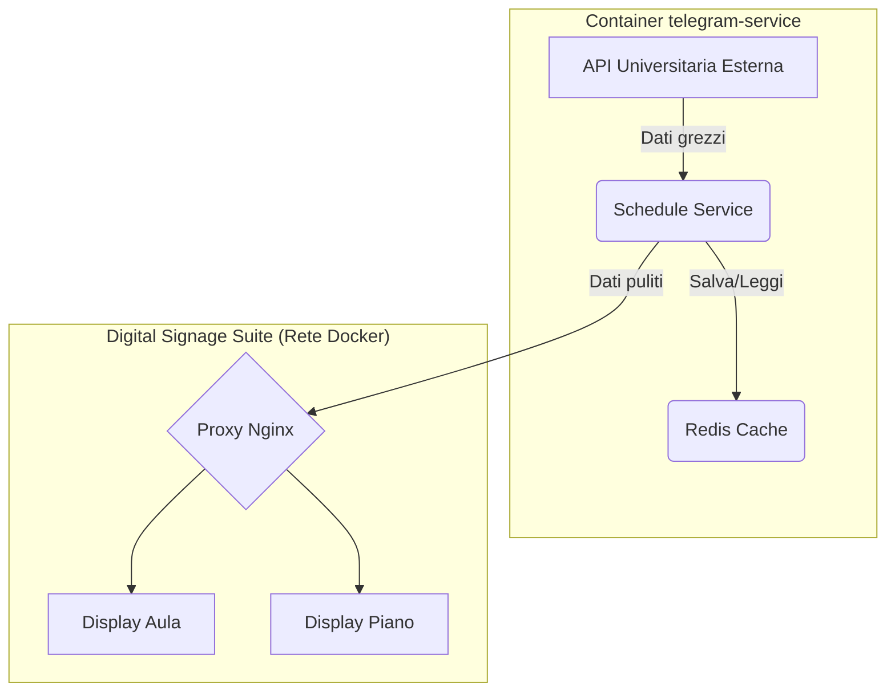

# Schedule Service (Servizio Orari)

[](https://shields.io/)
[](https://www.python.org/)
[](https://flask.palletsprojects.com/)
[](https://opensource.org/licenses/MIT)

Un microservizio per visualizzare in tempo reale gli orari delle lezioni universitarie, sia per singole aule che per interi piani di un edificio.


Il **`schedule-service`** è un microservizio backend robusto e scalabile, parte integrante della **Digital Signage Suite**. Il suo scopo principale è agire come intermediario tra un'API universitaria esterna (come quella dell'Università di Messina) e i vari display del sistema, fornendo dati sugli orari delle lezioni in modo efficiente, affidabile e sicuro.

---

## Indice

- [Panoramica del Progetto](#panoramica-del-progetto)
- [Diagramma dell'Architettura](#diagramma-dellarchitettura)
- [Caratteristiche Principali](#caratteristiche-principali)
- [Tecnologie Utilizzate](#tecnologie-utilizzate)
- [Struttura della Directory](#struttura-della-directory)
- [Prerequisiti](#prerequisiti)
- [Guida all'Installazione](#guida-allinstallazione)
- [Accesso e Link Utili](#accesso-e-link-utili)
- [Variabili d'Ambiente](#variabili-dambiente)
- [Documentazione API](#documentazione-api)
- [Esecuzione dei Test](#esecuzione-dei-test)
- [Come Contribuire](#come-contribuire)
- [Licenza](#licenza)

---

## Panoramica del Progetto

In un sistema di digital signage distribuito, interrogare direttamente un'API esterna da ogni singolo display è inefficiente e rischioso. Creerebbe un carico eccessivo sull'API e renderebbe il sistema vulnerabile a interruzioni di rete.

Il `schedule-service` risolve questi problemi centralizzando la logica di recupero dati. Agisce come un unico punto di accesso intelligente che:
1.  **Recupera** i dati una sola volta.
2.  Li **mette in cache** utilizzando Redis per performance elevate.
3.  Li **serve** a tutti i client (display, totem, bot) attraverso un'API interna veloce e sicura.

---

## Diagramma dell'Architettura

Questo diagramma illustra il flusso dei dati e il ruolo del `schedule-service` all'interno dell'ecosistema.


_Il servizio funge da gateway e cache, proteggendo l'API esterna e garantendo risposte rapide._

---

## Caratteristiche Principali

- ✅ **API Robusta**: Fornisce endpoint per ottenere le lezioni di una singola aula o di un intero piano.
- ⚡ **Caching Performante**: Utilizza **Redis** per una cache persistente e condivisa, migliorando drasticamente le performance e riducendo il carico sull'API esterna.
- 🛡️ **Sicurezza**:
    - **Rate Limiting**: Protegge gli endpoint da abusi (es. attacchi DoS) limitando il numero di richieste per IP.
    - **Configurazione Sicura**: Le variabili d'ambiente non sono incluse nell'immagine Docker ma iniettate al runtime.
- ⚙️ **Flessibilità**: I dati di configurazione di aule e edifici sono gestiti tramite un file `JSON` esterno, permettendo modifiche senza dover ricompilare il codice.
- 🖥️ **Interfaccia Web**: Serve due viste HTML pre-configurate per la visualizzazione su monitor.
- ❤️ **Health Check**: Endpoint `/health` per un facile monitoraggio dello stato del servizio da parte di orchestratori come Docker.
- 🐳 **Containerizzato**: Completamente gestito tramite Docker e Docker Compose per un deploy semplice, ripetibile e consistente su qualsiasi ambiente.
- 🧪 **Testato**: Include una suite di test di integrazione (`pytest`) per garantire l'affidabilità e facilitare la manutenzione.

---

## Tecnologie Utilizzate

| Categoria | Tecnologia |
| :--- | :--- |
| **Backend** | Python 3.11, Flask |
| **Server WSGI** | Gunicorn |
| **Cache & Storage** | Redis |
| **Containerizzazione** | Docker, Docker Compose |
| **Validazione Dati** | Pydantic |
| **Testing** | Pytest, Requests |
| **Sicurezza**| Flask-Limiter, Flask-Talisman, Flask-Cors |

---

## Struttura della Directory

Il progetto è organizzato in modo da separare chiaramente la logica dell'applicazione, la configurazione, i test e l'interfaccia utente.

```
schedule-service/
├── app/                    # Codice sorgente dell'applicazione Flask
│   ├── api/                # Definizione delle rotte e degli endpoint
│   │   └── routes.py
│   ├── services/           # Logica di business e interazione con la cache
│   │   ├── models.py       # Modelli Pydantic e funzioni helper per la cache
│   │   └── services.py     # Logica di business (recupero, parsing dati)
│   ├── __init__.py         # Application factory (crea l'app Flask)
│   └── config.py           # Carica la configurazione da variabili d'ambiente
│
├── config/                 # File di configurazione esterni
│   └── classroom_data.json # Mappa di aule, piani ed edifici
│
├── tests/                  # Test automatici
│   ├── __init__.py
│   └── test_api.py         # Test di integrazione per gli endpoint API
│
├── ui/                     # Tutti i file del front-end
│   ├── assets/             # Immagini, icone, ecc.
│   ├── static/             # File CSS e JavaScript
│   ├── classroom_view.html # Pagina per la singola aula
│   └── floor_view.html     # Pagina per l'intero piano
│
├── .env                    # Variabili d'ambiente LOCALI (non versionato su Git)
├── Dockerfile              # Istruzioni per costruire l'immagine del servizio
├── requirements.txt        # Dipendenze Python
└── run.py                  # Punto di ingresso per avviare il servizio
```

---

## Prerequisiti

Per eseguire questo servizio, è necessario avere installato:
- [Docker Engine](https://docs.docker.com/engine/install/)
- [Docker Compose V2](https://docs.docker.com/compose/install/) (il plugin che si usa con `docker compose`)

---

## Guida all'Installazione

1.  **Clona il Repository**
    ```bash
    git clone https://github.com/Mantineo-Massimo/DigitalSignageSuite.git
    cd DigitalSignageSuite
    ```

2.  **Configura le Variabili d'Ambiente**
    Naviga nella cartella `schedule-service` e crea una copia del file di esempio `.env.example`.
    ```bash
    cd schedule-service
    cp .env.example .env
    ```
    Apri il file `.env` appena creato e personalizza le variabili se necessario.

3.  **Avvia l'Intero Stack**
    Torna alla cartella principale `DigitalSignageSuite` ed esegui il comando:
    ```bash
    docker compose up --build -d
    ```
    Questo comando costruirà le immagini, creerà la rete e avvierà i container in background.

---

## Accesso e Link Utili
Una volta avviato lo stack, tutti i servizi sono accessibili tramite il proxy Nginx sulla porta `80`. L'indirizzo base sarà `http://localhost/` o l'IP della macchina host.

### Vista Aula
Per visualizzare l'orario di una singola aula, usa il seguente formato:
`http://localhost/schedule/classroom_view.html?classroom=<ID_AULA>&building=<ID_EDIFICIO>`

- **Esempio:**
  ```
  http://localhost/schedule/classroom_view.html?classroom=5f775da9bb0c1600171ae370&building=5f6cb2c183c80e0018f4d46
  ```

### Vista Piano
Per visualizzare l'orario di un intero piano, usa il seguente formato:
`http://localhost/schedule/floor_view.html?building=<SIGLA_EDIFICIO>&floor=<NUMERO_PIANO>`

- **Esempio:**
  ```
  http://localhost/schedule/floor_view.html?building=A&floor=1
  ```

### Health Check (Stato del Servizio)
Questo link è usato per monitorare se il servizio è attivo e funzionante. Restituisce una risposta JSON.

- **Link:**
  ```
  http://localhost/schedule/health
  ```
- **Risposta Attesa:** `{"status": "ok"}`

---

## Variabili d'Ambiente

Il file `.env` nella cartella `schedule-service` richiede le seguenti variabili:

- `LESSON_API_BASE_URL`: **(Obbligatorio)** L'URL di base dell'API pubblica da cui vengono recuperati gli orari.
- `REDIS_URL`: **(Obbligatorio)** L'URL di connessione per il server Redis. Deve usare il nome del servizio (`redis://redis_cache:6379/0`) quando si esegue con Docker Compose.
- `CACHE_TTL_MINUTES`: *(Opzionale)* Il tempo di validità (Time-To-Live) dei dati nella cache, espresso in minuti. **Default: `15`**.

---

## Documentazione API

Tutti gli endpoint sono esposti tramite il proxy Nginx e quindi richiedono il prefisso `/schedule/`.

| Metodo | Percorso | Descrizione | Corpo Richiesta (JSON) | Risposta Successo (200) |
| :--- | :--- | :--- | :--- | :--- |
| `POST` | `/schedule/lessons` | Recupera le lezioni per un'aula. | `{ "classroom": "id_aula", "building": "id_edificio" }` | `[ { "lesson_name": "...", ... } ]` |
| `GET` | `/schedule/floor/<bld>/<flr>` | Recupera le lezioni per un piano. | N/A | `[ { "lesson_name": "...", ... } ]` |
| `GET` | `/schedule/health` | Endpoint di health check. | N/A | `{ "status": "ok" }` |

---

## Esecuzione dei Test

I test di integrazione verificano che gli endpoint principali si comportino come previsto.

**Prerequisiti:** Lo stack Docker deve essere in esecuzione.

Per lanciare i test, esegui questo comando dalla cartella principale `DigitalSignageSuite`:
```bash
pytest
```

---

## Come Contribuire

I contributi sono sempre i benvenuti! Per contribuire:
1.  Fai un fork del repository.
2.  Crea un nuovo branch (`git checkout -b feature/nome-feature`).
3.  Fai le tue modifiche e assicurati che i test passino (`pytest`).
4.  Fai il commit delle tue modifiche (`git commit -am 'Aggiungi nuova feature'`).
5.  Fai il push sul tuo branch (`git push origin feature/nome-feature`).
6.  Apri una Pull Request.

---

## Licenza

Questo progetto è rilasciato sotto la Licenza MIT. Vedi il file `LICENSE` per maggiori dettagli.